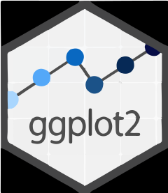

<!--
Here are some ideas to get you started:
- 🔭 I’m currently working on ...
- 🌱 I’m currently learning ...
- 👯 I’m looking to collaborate on ...
- 🤔 I’m looking for help with ...
- 💬 Ask me about ...
- 📫 How to reach me: ...
- 😄 Pronouns: ...
- ⚡ Fun fact: ...
------------------------------------------------------------------------------------------------------------------>

  

# 🌐 Relevant Links:
### To instantly download my CV in pdf format, [click here](https://github.com/Arthur-Benitez/Arthur-Benitez/files/11471393/CV.Arturo.Benitez.Eng.pdf)

For other links, click on any icon:

	
	<table cellspacing="5" cellpadding="5" width="100%">
		<tr> 
			<td align="center">
				
			</td>
			<td align="center">
				
			</td>
			<td align="center">
				  
			</td>
		</tr>
		<tr> 
			<td align="center">
				LinkedIn
			</td>
			<td align="center">
				WhatsApp
			</td>
			<td align="center">
				E-mail 
			</td>
		</tr>
		<tr>
			<td align="center">
				
			</td>
			<td align="center">
				
			</td>
			<td align="center">
				  
			</td>
		</tr>
		<tr>
			<td align="center">
				Resume / CV
			</td>
			<td align="center">
				Portfolio
			</td>
			<td align="center">
				Indeed
			</td>
		</tr> 
	</table>

# 💻 Tech Stack:
### ETL & Data Processing

	
	<table cellspacing="5" cellpadding="5" width="100%">
		<tr> 
			<td align="center">					</td>
			<td align="center">					</td>
			<td align="center">					</td>
		</tr>
		<tr> 
			<td align="center">		SQL															</td>
			<td align="center">		R / RStudio													</td>
			<td align="center">		Alteryx														</td>
		</tr>
		<tr> 
			<td align="center">					</td>
			<td align="center">					</td>
			<td align="center">					</td>
		</tr>
		<tr> 
			<td align="center">		Excel														</td>
			<td align="center">		LookML														</td>
			<td align="center">		Python														</td>
		</tr>
	</table>

### Dashboards & Data Visualization

	
	<table cellspacing="5" cellpadding="5" width="100%">
		<tr> 
			<td align="center">			</td>
			<td align="center">			</td>
			<td align="center">			</td>
		</tr>
		<tr> 
			<td align="center">		Tableau														</td>
			<td align="center">		Looker														</td>
			<td align="center">		Looker Studio												</td>
		</tr>
		<tr> 
			<td align="center">			</td>
			<td align="center">			</td>
			<td align="center">			</td>
		</tr>
		<tr> 
			<td align="center">		GGPlot														</td>
			<td align="center">		Shiny														</td>
			<td align="center">		Plotly (R)													</td>
		</tr>
	</table>

### Agile & Scrum Tools

	
	<table cellspacing="5" cellpadding="5" width="100%">
		<tr> 
			<td align="center">			</td>
			<td align="center">			</td>
			<td align="center">			</td>
			<td align="center">			</td>
		</tr>
		<tr> 
			<td align="center">		Jira Software												</td>
			<td align="center">		Jira SM														</td>
			<td align="center">		Trello														</td>
			<td align="center">		Leankit														</td>
		</tr>
	</table>

### General Purpose Apps

	
	<table cellspacing="5" cellpadding="5" width="100%">
		<tr> 
			<td align="center">					</td>
			<td align="center">					</td>
		</tr>
		<tr> 
			<td align="center">		Microsoft Office											</td>
			<td align="center">		Google Workspace											</td>
		</tr>
	</table>

# 📊 GitHub Stats:

 

---

